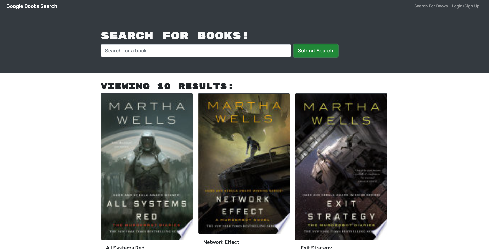

# Book Search Engine

## [Deployed Application](https://akw-book-search.herokuapp.com/)
 

## Description
This application is a MERN stack application with a REACT front end, MongoDB database and Node.js/Experss.js server and API, and utilizes Google Books API. 

## Table of Contents
- [Installation](#installation)
- [Usage](#usage)
- [Credits](#credits)
- [License](#license)
- [Contributing](#contributing)
- [Tests](#tests)
- [Questions](#questions)

## Installation
To run the application, simply enter the URL in any browser.

## Usage
A user can login, browse books by title, author, genre, etc., save and remove books from their profile.

## Credits
Collaborators: UCLA Full Stack Flex Coding Bootcamp Starter Code  
Amaryah Wolf

## License
This application is covered under the MIT license.

## Contributing
[Contributor Covenant](https://www.contributor-covenant.org/version/2/1/code_of_conduct/)

## Tests
N/A

## Questions
For additional questions, find me on [github](https://github.com/amaryahwolf) or email me at amaryahwolf@gmail.com.
